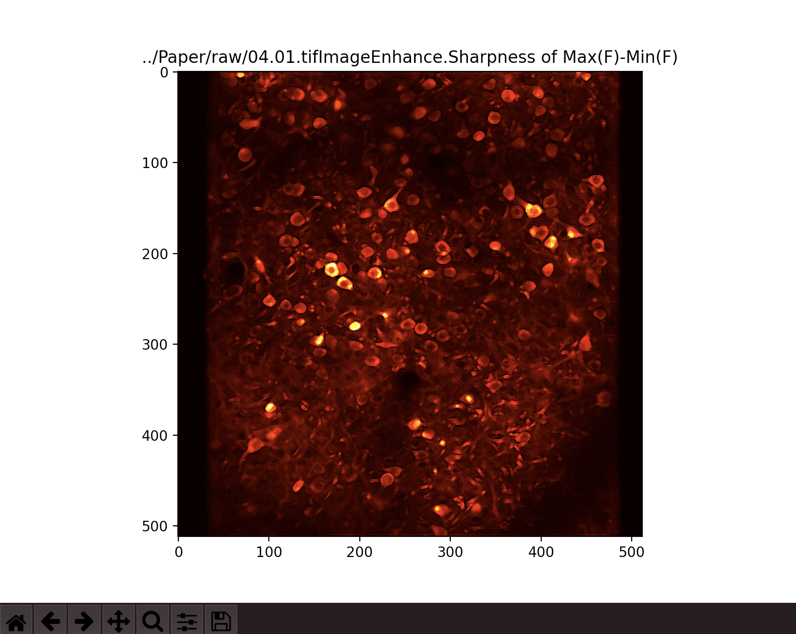

# Max-Min-dF
A program for detecting calcium imaging by max-min intensity methods in Python. Calcium imaging has been widely applied to infer neuron activity in different brain regions in vivo. Following with several major kernel methods being developed, several state-of-art computational tools and pipelines for analyzing the calcium imaging video data have been proposed and the prediction results were usually shown over a “reference” image, such as the mean and local max-correlation images. However, these reference images sometime may not look like as the those shown in the original videos by visual inspection. Moreover, how to examine and select the neurons of interest from several hundreds or thousands of predicted candidates for further study may not be easy for users.

## Usage
```Python
python3 E0_Max_Min_dF_ddfF_deconv.py -all -i example.tif
```
## Argument
| Argu | Description | Default |
|-------|-----|------|
| -i       | to assign input file name or path | code path|
| -all     | to output all images | off |
| -ns      | to turn off median filter smoothing  | on |
| -out     | generate a max(F)-min(F) image in PNG format  | off |
| -wdff    | generate a max(F)-min(F) image in PNG format  | off |
| -wddfdf  | generate a differnece max-min image in PNG format  | off |
| --top    | set the maximum percentile as the maximum  | 100 |
| -fmax    | the maximum display value for max_min(F)   | off |
| -fmin    | the minimum display value for max_min(F)   | off |
| -dfmax   | the maximum display value for max_min(dF)  | off |
| -dfmin   | the minimum display value for max_min(dF)  | off |
| -noblank | to turn off the blank checking procedur    | off |
